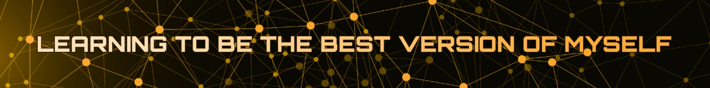

<p align="center">
  
</p>

<div align="center" style="text-align: center">
  <a href="https://iturres.github.io/iturres-reactive-portfolio/" target="_blank" rel="noopener noreferrer">
    
  </a>

  [](https://git.io/typing-svg)

  [My Resume 🇬🇧](https://docs.google.com/document/d/1oCGTGmHpSoumnVm-3aEKVdW8zkpKnAbf/edit?usp=sharing&ouid=111255547278244482581&rtpof=true&sd=true) ⬅️➡️
  [Mi Curriculum 🇦🇷](https://docs.google.com/document/d/155WWAGTIkLMuwPwve3K_Cw6bJuktdht8/edit?usp=sharing&ouid=111255547278244482581&rtpof=true&sd=true)
</div>

<p align="center">
    
    
</p>

<div style="text-align: center">

[](https://git.io/typing-svg)

<div>
  <p align="center">
    <a href="https://skillicons.dev">
      
    </a>
  </p>
</div>

[](https://git.io/typing-svg)

<div>
  <p align="center">
    <a href="https://skillicons.dev">
      
    </a>
  </p>
</div>

<br>

<!--  -->

```js
const arthurIturres = {
  about: [
    `👷🏼‍♂️ Currently working on a Workflow Management System,
        Coaching Managememt System and an E-commerce`,
    `👨‍💻 Technical Team Lead at NetNet LLC,
        Frontend Web Engineer at Awesome Org`,
    '👨‍🏫 Web Development Instructor at Bootcamp Xperience',
    '📚 Fond of technical, business, self-help and travel books.',
    '🚀 I thrive on Leading, collaborating, organizing, and working with teams.',
    "🍀 I'm on my way to realizing my second dream, having accomplished the first.",
    '⌚🪵 I do a bit of watchmaking and Wood work.',
    '🖥 I enjoy designing web applications.',
    '🙇🏻‍♂️ Currently working with React.ts and Angular',
    `🌟 Besides web development in general, I specialize in optimizing development workflows,
        enforcing programming standards, and advocating for adherence to best
        practices to ensure clean, scalable and professional codebases.`
  ],
  futureLearningGoals: [
    '🥖 French.',
    '🐦 Swift.',
    '🤖 Kotlin.',
    '🎤 Give technical and soft skills talks.',
    '🏂 Snowboarding.',
    '⛵ Hitchhike a boat.'
  ]
};

```

</div>

---

<h2 align="center">Do you enjoy reading? 🤓</h2>

<p align="center">📚 Here is a curated list of the books I read, that I would like to share with you... 📚</p>

#### 📖 = Books I'm currently reading

<details>
  <summary>🛠️ Technical Books:</summary>
    <ul align='left'>
      <li>📖 "The Pragmatic Programmer" - By Andrew Hunt and David Thomas.</li>
      <li>📘 "ProGit" - By Scott Chacon and Ben Straub.</li>
      <li>📘 "Think Like a Programmer" - By V. Anton Spraul.</li>
      <li>📖 "Javascript The Definitive Guide" - By David Flanagan.</li>
      <li>📘 "Learning React" - By Alex Banks and Eve Porcello.</li>
      <li>📘 "Redux in Action" - By Marc Garreau and Will Faurot.</li>
      <li>📘 "The Ruby programming language" - By David Flanagan and Yukihiro Matsumoto.</li>
      <li>📖 "A Common Sense Guide to DSA - 2nd Edition" - By Jay Wengrow.</li>
      <li>📖 "You Dont Know JavaScript" - By Kyle Simpson.</li>
      <li>📖 "Clean Code" - By Robert C. Martin.</li>
    </ul>
</details>

<details>
<summary>💼 Business Books:</summary>
    <ul align='left'>
      <li>📕 "The Phoenix Project, A novel about IT, DevOps and helping your business win" - By Gene Kim, George Spafford and Kevin Behr.</li>
      <li>📕 "The Five Dysfunctions of a Team" - By Patrick Lencioni.</li>
      <li>📖 "The Effective Engineer" - By Edmond Lau.</li>
      <li>📖 "Slicing Pie: Funding Your Company Without Funds" - By Mike Moyer.</li>
      <li>📖 "The Manager's Path - A Guide for Tech Leaders Navigating Growth & Change" - By Camille Fournier.</li>
    </ul>
</details>

<details>
  <summary>🧠 SelfHelp Books:</summary>
    <ul align='left'>
      <li>📗 "Feel The Fear And Do It Anyway" - By Susan Jeffers.</li>
      <li>📗 "Ego is the Enemy" - By Ryan Holiday.</li>
      <li>📗 "Growth Mindset" - By Carol S. Dweck.</li>
      <li>📗 "Declutter Your Mind" - By S.J. Scott and Barrie Davenport.</li>
    </ul>
</details>

<details>
  <summary>🗺️ Travel Books:</summary>
    <ul align='left'>
      <li>📙 "Hitchhiking in The Axis of Evil" - By Juan Pablo Villarino.</li>
      <li>📙 "Always the West" - By J.M. Romero.</li>
      <li>📙 "Magic is travelling" - By Aldana Chiodi and Dino Feldman.</li>
      <li>📙 "A Tango in Tibet" - By Juan Pablo Villarino.</li>
      <li>📙 "The Alchemist" - By Paulo Coelho.</li>
    </ul>
</details>

---

<div style="text-align: center">

<br>

<p align="center">
  

  <p align="center">I once was ranked at 5th place 😭</p>
</p>

<p align="center">
  
</p>
  
<p align="center">
    
</p>
  
  

</div>
