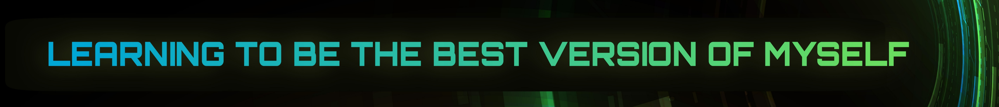
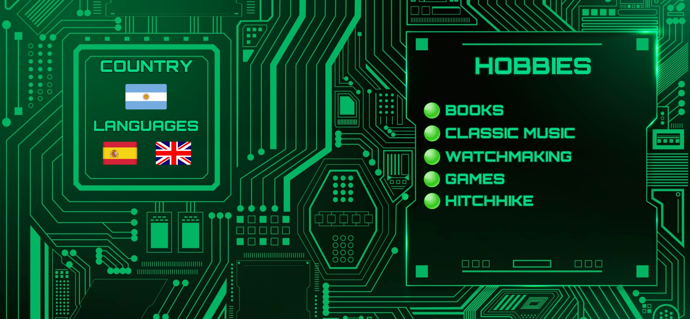

# I am Emanuel ITurres!

## My Skills so far________________________________________

# To contact me...

### **🔵 [LinkedIN](https://www.linkedin.com/in/emanuel-iturres/)**
### **🟠 <a href="mailto:emanueliturres.co@gmail.com" target="_blanck">Gmail</a>**
 
 
