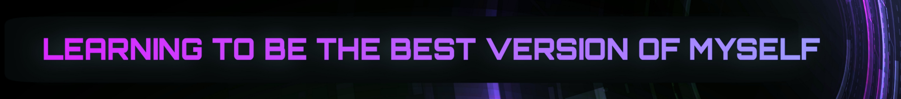
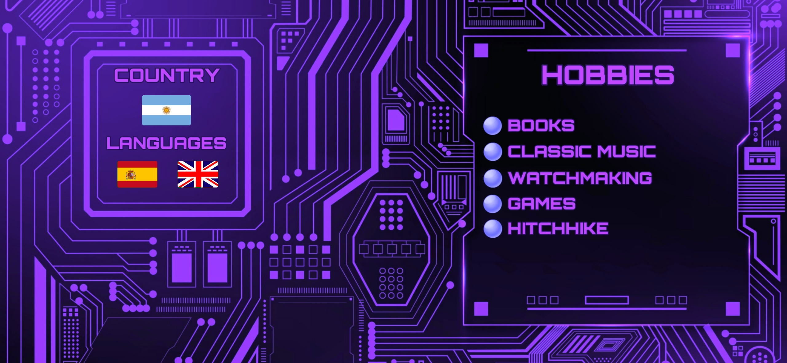

 

# <h1 style="color: purple; -webkit-text-stroke: 2px offBlack">I am Arthur ITurres!</h1>

# 
learning...

## 

 
 

 

# 
To contact me...

### **🔵 [LinkedIN](https://www.linkedin.com/in/emanuel-iturres/)**

### **🟠 <a style="color: orange" href="mailto:emanueliturres.co@gmail.com" target="_blanck">Gmail</a>**

 
 

