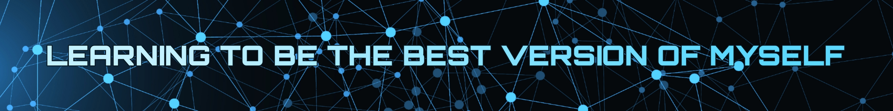

<p align="center">
  
  

  <p align="center"><strong>10</strong> days left of holidays 🎄</p>
</p>

<br/>

<p align="center">
    
    
</p>

<div style="text-align: center">

[](https://git.io/typing-svg)

<div> 
  <p align="center">
    <a href="https://skillicons.dev">
      
    </a>
  </p>
</div>

<br>

<!--  -->

```js
const profileData = {
  aboutMe: [
    '👨‍💻 I am a self-taught web developer.',
    '💻 Focus on front-end development.',
    '💻 Learning back-end development.',
    '📚 Fond of technical, travel books, and more.',
    '🚀 I thrive on collaborating, organizing, and working with peers.',
    "🍀 I'm on my way to realizing my second dream, having accomplished the first.",
    '⌚ I do a bit of watchmaking.',
    '🙇🏻‍♂️ Currently learning TypeScript, Rails and DSA.',
  ],
  futureLearningGoals: [
    '🥖 French.',
    '🐦 Swift.',
    '🅰️ Angular.',
    '🏂 Snowboarding.',
  ]
};

```
</div>

---

<h2 align="center">Do you enjoy reading? 🤓</h2>

<p align="center">📚 Here is a curated list of the books I read, that I would like to share with you... 📚</p>

#### 📖 = Books I'm currently reading

<details>
  <summary>🛠️ Technical Books:</summary>
    <ul align='left'>
      <li>📖 The Pragmatic Programmer - By Andrew Hunt and David Thomas.</li>
      <li>📘 ProGit - By Scott Chacon and Ben Straub.</li>
      <li>📘 Think Like a Programmer - By V. Anton Spraul.</li>
      <li>📖 Javascript The Definitive Guide - By David Flanagan.</li>
      <li>📘 Learning React - By Alex Banks and Eve Porcello.</li>
      <li>📖 Redux in Action - By Marc Garreau and Will Faurot.</li>
      <li>📖 The Ruby programming language - By David Flanagan and Yukihiro Matsumoto.</li>
      <li>📖 The Phoenix Project, A novel about IT, DevOps and helping your business win - By Gene Kim, George Spafford and Kevin Behr</li>
    </ul>
</details>

<details>
  <summary>🧠 SelfHelp Books:</summary>
    <ul align='left'>
      <li>📗 Feel The Fear And Do It Anyway - By Susan Jeffers.</li>
      <li>📗 Ego is the Enemy - By Ryan Holiday.</li>
      <li>📗 Growth Mindset - By Carol S. Dweck.</li>
      <li>📗 Declutter Your Mind - By S.J. Scott and Barrie Davenport.</li>
    </ul>
</details>

<details>
  <summary>🗺️ Travel Books:</summary>
    <ul align='left'>
      <li>📙 Hitchhiking in The Axis of Evil - By Juan Pablo Villarino.</li>
      <li>📙 Always the West - By J.M. Romero.</li>
      <li>📙 Magic is travelling - By Aldana Chiodi and Dino Feldman.</li>
      <li>📙 A Tango in Tibet - By Juan Pablo Villarino.</li>
      <li>📙 The Alchemist - By Paulo Coelho.</li>
    </ul>
</details>

---

<div style="text-align: center">

<br>

<p align="center">
  
</p>

<p align="center">
  
</p>
  
<p align="center">
    
</p>
  
  

</div>
